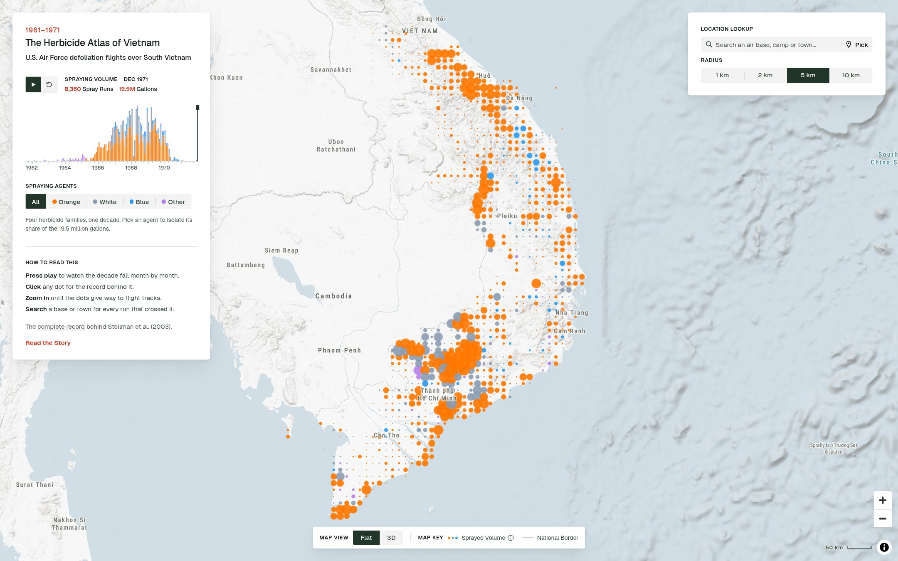
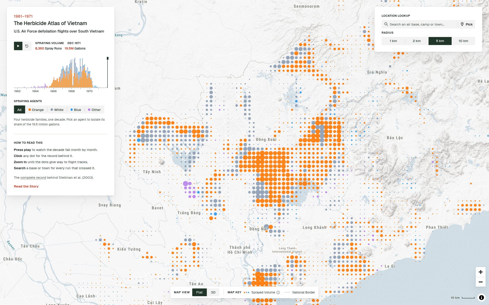
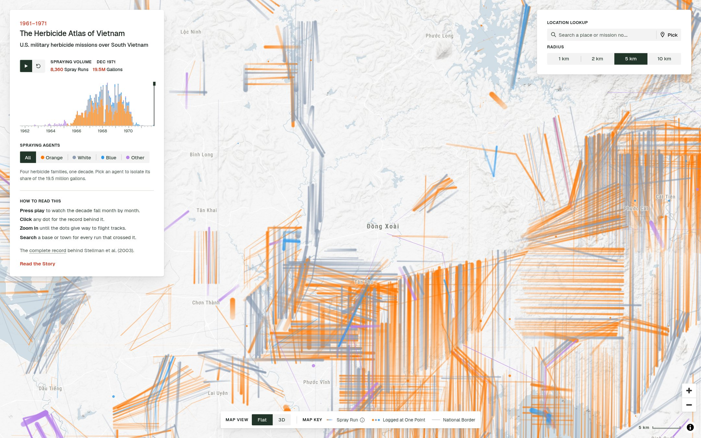
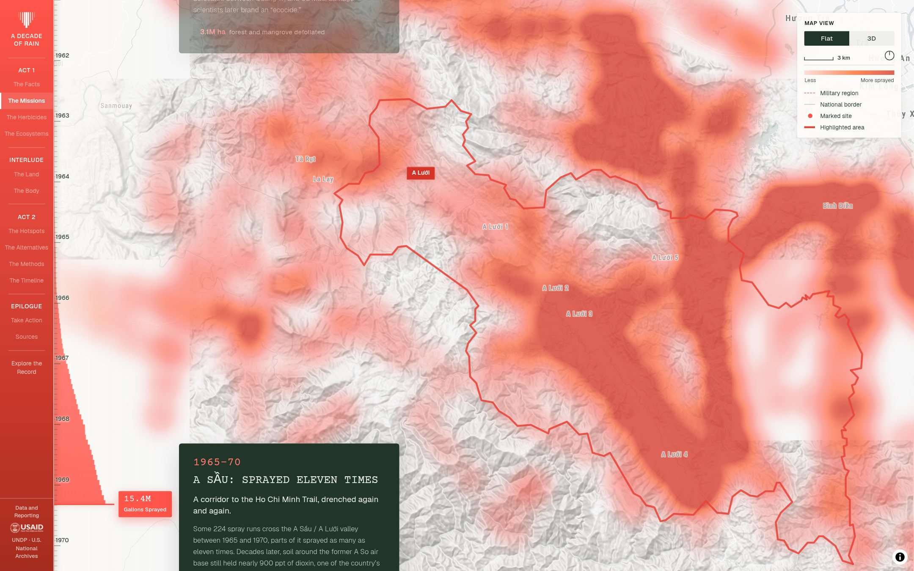
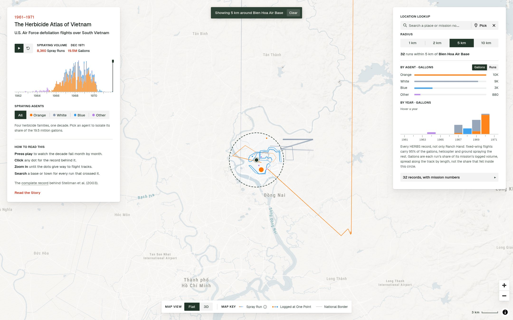

# Where the Herbicide Fell: Reading the HERBS Record as Flight Tracks

## Methods behind *A Decade of Rain* and *The Herbicide Atlas of Vietnam*

**Si Zheng** · Draft for comment · September 2026
Prepared for Jeanne Mager Stellman and Andrew B. Stellman

Live surfaces: <https://adecadeofrain.sizheng.me/> (the Story) and <https://adecadeofrain.sizheng.me/archive> (the Atlas).
Source and analysis scripts: <https://github.com/zheng-si/a-decade-of-rain>.

---

## Abstract

*A Decade of Rain* is a scroll-driven narrative of Operation Ranch Hand, and *The Herbicide Atlas of Vietnam* is an interactive explorer of the same record: a playable decade, three zoom-dependent encodings of the spray volume, an agent filter, and a lookup that returns the individual runs that passed within a chosen radius of a place, or the runs of a given HERBS mission number. Both are drawn from one dataset, the HERBS file as republished in Andrew Stellman's open `hea-v` repository, pinned to a single commit.

This note documents how that record becomes a picture. It has one substantive finding. The HERBS file books each mission's entire volume against a single row, the first waypoint of its first run, while recording the aircraft's track as a chain of further waypoints; the median run is an 11 km polyline. A map drawn directly from the file's fields therefore places a mission's whole volume in the one cell containing one end of its first track. Measured over the whole record, turning that "booked" field into one in which the volume is spread along the flown tracks requires physically relocating 59% of all gallons at a 3 km cell, and leaves 63% of cells that received herbicide reading as zero. Within the family of readings the record itself admits (the herbicide fell somewhere along the recorded track) the answer is stable to about ±14% at 3 km under rate profiles far more extreme than an aircraft is likely to have flown; the booked reading sits roughly four times outside that envelope. Both shipped surfaces therefore draw the record as lines, with totals conserved to the gallon.

The note also records the georeferencing, the run reconstruction, every encoding constant, the checks that hold them together, and the limits of what the maps can be asked. It closes with the specific questions we would value your judgement on, including two we found while writing it and have since acted on: the tape's own documentation books volume per mission rather than per spray track, so the pipeline now spreads each mission's load across every track it flew (a 4.8% correction at 3 km, Section 4.3), and the file contains helicopter and ground records that one of the Atlas's caveats denied until this draft (Section 8).

---

## 1 · Purpose and scope

The project has two surfaces on one dataset.

- **The Story** (`/`) is a scrollytelling piece in eight nodes, from the 1961 test sprays to the 1971 reckoning, over a single continuous heat field that fills in as the reader scrolls, followed by chapters on consequences, remediation methods, alternatives, a timeline and a close. Its map is a kernel-density surface: the field metaphor of rain on the land.
- **The Atlas** (`/archive`) is an explorer. The decade plays month by month; a chart of monthly volume doubles as the scrubber; an agent filter isolates one herbicide family; the map hands off between three encodings as the reader zooms (aggregated dots at two cell sizes, then the flight tracks themselves); a click on any mark opens the record behind it; a place search or a dropped pin returns every run that passed within 1 to 10 km, cited by HERBS mission and run number.

Both are static web pages built with MapLibre GL JS and React. There is no server and no database: the record ships as three JSON files (687 kB, 695 kB and 551 kB), built once by scripts kept in the repository, and every figure on screen is computed in the browser from those files.

This is a methods note, not a results paper. Its purpose is to let the people who built HERBS check what we have done with it. Section 9 lists the questions we would most value an answer to.

---

## 2 · The source record

### 2.1 Provenance

The record is `data/herbs.json` from `github.com/andrewstellman/hea-v`, the open digitisation of the HERBS file behind Stellman et al. (2003), used under its MIT licence and pinned to commit `cb5948bb6b48cb731f139bc3143ae36d0de02b81`. Every number in this note was recomputed from that commit; the build scripts fetch from it and from no other snapshot. We also use `data/gridpoints.json` from the same commit: 263,353 points on a regular 0.01° lattice covering 102.64–110.19°E, 8.50–20.68°N, which we take to be the study-area grid of the 2003 work (Section 9, question 5).

The file has 24,604 rows and fourteen fields: `Date`, `Mission`, `Run`, `CTZ`, `Source`, `Incident`, `Method`, `Leg`, `UTM`, `Agent`, `Gallons`, `FWAC`, `Type`, `Province`. Dates run from 10 August 1961 to 27 December 1971.

The tape's record layout is documented column by column in the 1985 US Army report that produced the Services HERBS supplement (Christian, 1985), which we located while writing this note; the code meanings below follow it. The HERBS system document it descends from (Data Management Agency, US MACV, 1970) is the one Stellman et al. (2003) cite as their reference 3.

### 2.2 What the fields contain

Table 1 gives the code distributions as observed. The meanings in the right-hand column follow the 1985 record layout where it lists the code; the codes it does not list are marked, and Section 9 asks about them.

**Table 1. Code fields at the pinned commit.**

| Field | Code | Rows | Gallons | Share of volume | Our reading |
|---|---|---:|---:|---:|---|
| `Agent` | O | 13,010 | 12,066,840 | 61.9% | Agent Orange |
| | W | 5,728 | 5,430,462 | 27.9% | Agent White |
| | B | 3,421 | 1,252,541 | 6.4% | Agent Blue |
| | P | 1,087 | 500,018 | 2.6% | Agent Purple |
| | U | 1,336 | 227,538 | 1.2% | Unknown / unspecified |
| | K | 16 | 13,291 | 0.07% | Agent Pink? (the layout lists Pink as R and Pink & Green as S; K is not listed) |
| | D, T | 4, 2 | 0 | 0 | Dinoxol, Trinoxol |
| `Method` | F | 16,488 | 18,603,176 | 95.4% | Fixed-wing aircraft |
| | H | 5,762 | 733,262 | 3.8% | Helicopter |
| | U | 1,269 | 96,940 | 0.5% | Unknown |
| | G | 1,081 | 48,312 | 0.25% | Ground |
| | S | 4 | 9,000 | 0.05% | not in the layout |
| `Source` | R | 18,150 | 17,536,106 | 90.0% | Ranch Hand data files |
| | S | 6,320 | 1,893,722 | 9.7% | Services HERBS Tape files |
| | A | 134 | 60,862 | 0.3% | not in the layout |
| `Type` | D | 14,248 | 16,855,761 | 86.5% | Defoliation |
| | C | 3,837 | 1,753,986 | 9.0% | Crop destruction |
| | P, F, S, U, W, E | 3,224 … 230 | 395,953 … 39,798 | 4.5% together | P perimeter spraying around an installation; F friendly line of communication; S enemy supply cache; W waterway or landing zone; E enemy infiltration or supply route; U not listed |
| `CTZ` | 1 / 2 / 3 / 4 | 5,144 / 6,716 / 9,119 / 2,832 | | | Corps Tactical Zones I–IV |
| | 5 / 6 / 7 | 668 / 1 / 124 | | | (unknown) |
| `Incident` | blank | 24,535 | | | |
| | Z, R, E, L, A | 42, 16, 5, 5, 1 | | | Z emergency dump; R spray on the wrong target; E crash with the load aboard; L leak; A abort of mission or aircraft |

`Province` carries 50 distinct values and is blank on 16,628 rows. `UTM` is an eight-character military grid reference on every row (a two-letter 100 km square identifier and two three-digit coordinates, so 100 m precision), drawn from 55 distinct 100 km squares; it carries no zone number. `FWAC` is a six-digit string on 8,045 rows, structured as three two-digit fields that are almost always equal (`030303` on 2,575 rows, `020202` on 1,308, `040404` on 647, and so on); `hea-v`'s own engine reads the aircraft count from the last two digits, and we follow it. It is present on 5,898 of the 5,957 fixed-wing lead rows (99%) and on none of the 2,108 helicopter or 446 ground lead rows, which is what we would expect of a *fixed-wing aircraft count* and is our main reason for reading `Method` H as helicopter.

The four `Agent` groups the maps draw are Orange, White, Blue, and Other (P, U, K, D and T together: 740,847 gallons, 3.8%).

Two facts about time. Volume by year is 1962: 40,185; 1963: 89,933; 1964: 223,696; 1965: 664,796; 1966: 2,633,301; 1967: 5,091,725; 1968: 4,923,932; 1969: 4,748,853; 1970: 1,045,201; 1971: 29,068. The 1961 rows (the first mission is dated 10 August 1961) carry no gallons at all, so the Story marks the test sprays with labelled points rather than heat.

### 2.3 The structure: missions, runs, legs

Rows group into **9,141 missions** (distinct `Mission` numbers) and **11,273 runs** (distinct `Mission` + `Run` pairs). Within a run, and within a mission, `Date` and `Agent` never vary; we checked every one.

The `Leg` field is a number followed by a letter, and the two parts index different things. The **letter** is the waypoint within a run (A, B, C …). The **number** is the run's position within its mission: a mission's first run is labelled 1A, 1B …, its second 2A, 2B …, and so on. The evidence is exact: there are 9,141 rows labelled `1A`, one per mission, and every run that lacks a `1A` row begins at `2A`, `3A` or later. A run is therefore a chain of waypoints, and a mission is one or more such chains flown on one day with one agent.

The 1985 layout says the same in the tape's own words. Columns 60 and 61 "identify the track number"; column 62 carries "track start, turn and stop codes", where "A" is "the starting point", each later letter "the UTM grid coordinate at which the aircraft changed flight direction", and the last letter the point "at which the spraying was stopped"; and "a successive number in columns 60 & 61 indicate that on the same mission after completing the previous spray track, the aircraft accomplished an additional spray track". Its worked example is a two-track mission: 1A, 1B, 1C and then 2A, 2B. What `hea-v` calls a run is the tape's spray track.

**Table 2. Shape of the record.**

| | |
|---|---|
| Waypoints per run | 1: 2,691 · 2: 6,385 · 3: 1,080 · 4: 620 · 5: 170 · 6: 137 · 7 or more: 190 |
| Runs per mission | 1: 7,707 · 2: 1,107 · 3: 148 · 4: 96 · 5 or more: 83 |
| Runs with more than one waypoint | 8,582 |
| Median gap between the last waypoint of one run and the first of the next, within a mission | 2.63 km |
| Median run, as a polyline | 10.9 km (p25 5.4, p75 17.0, p90 19.6, max 354.6) |

### 2.4 How the volume is booked

**All 19,490,690 gallons sit on rows labelled `1A`. Every other leg label sums to exactly zero.** This is measured against the source, not inferred.

The layout defines the gallons field (columns 29 to 33) as the "number of gallons of herbicide dispensed during the mission cited": a per-mission quantity. The tape carries no per-track volume. Three further measurements in the file say the same. First, the 2,132 runs that have no `1A` row (the second and later runs of multi-run missions) carry no volume, all of them. Second, among fixed-wing missions with a recorded aircraft count, the median volume per aircraft is 1,000 gallons for missions of one, two, four and six runs, and 925 and 967 for three and five (n = 5,896 missions; overall p25 900, p75 1,000; median three aircraft). A C-123's spray tank held 1,000 gallons. Third, a worked example: Mission 136, 18 January 1965, Agent Purple, two aircraft, is recorded as Run 138 (legs 1A and 1B; 2,000 gallons on 1A) and Run 139 (legs 2A and 2B; 0 gallons).

So the file books a mission's whole load once, against the first waypoint of its first track, which is what its documentation says it does. The 2,913 runs with no volume anywhere are of two kinds: 2,132 later runs of multi-run missions whose load is on the mission's lead row, and 781 lead runs that record a flight and no gallons. **8,360 missions carry volume**, one lead row each, and that is the count the Atlas shows as *Spray Runs* (Section 8). On the map, after the per-mission spread of Section 4.3, 10,205 of the 11,273 runs carry a share of it.

This booking is an accounting convention. It is not a statement about where herbicide landed, and a map drawn straight from these fields inherits the convention without saying so. Section 5 measures what that costs.

---

## 3 · Georeferencing

The grid references omit their UTM zone, and southern Vietnam spans zones 48 and 49. For each row we convert the reference under every candidate zone and latitude band (48 and 49 × N, P, Q, R) with the `mgrs` library and keep the candidate that lands nearest a point of the 0.01° lattice in `gridpoints.json`, accepting it only if it lies within 0.05° of one. The correct zone lands within about 0.01° of the lattice; the wrong one lands roughly 6° away, in the sea, so the choice is unambiguous. All 24,604 rows convert; none is dropped. Coordinates are rounded to 0.001°, about 111 m, which is coarser than the 100 m of the source reference and thirty times finer than the smallest cell any map uses, so positional quantisation is not a term in anything below.

Distances throughout are computed on a local equirectangular projection with a 6,371 km sphere. At the run lengths and lookup radii involved (under 10 km) the error is below the precision of the grid references themselves.

The same conversion runs twice, once in `scripts/build-spray-data.mjs` (which keeps six fields per row: longitude, latitude, day, agent, gallons, CTZ) and once in `scripts/build-spray-tracks.mjs` (which keeps the run identity). The two scripts are pinned to the same commit so that the point file and the line file can never describe different snapshots of the record.

---

## 4 · Reconstructing runs as lines

### 4.1 Segmentation

`build-spray-tracks.mjs` groups rows by `Mission` and `Run` in file order (the file's own order is the track; sorting by the leg label would be a second opinion about the flight path), splits a run wherever its leg *number* changes, and collapses consecutive duplicate coordinates. The result is 8,753 line segments from 8,545 runs, plus 2,829 single-point records from 2,728 runs that were logged at one grid reference and have no line to draw. The line file holds 21,770 vertices.

Splitting at a leg-number change affects 176 runs. Section 2.3 now suggests that a change of leg number within a `Mission` + `Run` pair is an irregularity rather than a turn, and the split is conservative either way: it never joins two waypoints the file did not put in sequence.

### 4.2 Spreading the volume

The source carries no per-waypoint quantity, so volume can only be spread along a track geometrically. We spread each mission's gallons along all of the line tracks that mission flew **in proportion to length**, on the physical argument that an aircraft with the valve open lays down a roughly constant amount per kilometre, and that the spray system was calibrated to a rate per area rather than a share per track. Each segment's share is rounded to a whole gallon; the build asserts that the gallons leaving by the two doors (spread along tracks, or parked on single-point records) equal the gallons that came in, to within one gallon per rounded segment. At the pinned commit the balance is 19,490,688 out against 19,490,690 in.

A single-point record inside a mission that also flew line tracks has no length to take a share of and takes none (107 such points, 71,220 gallons, 0.37% of the record, now on their sibling lines). A mission with no measurable length at all keeps its gallons split evenly by count across its points, with the remainder on the first. (An earlier version handed every such point the run's full volume; the guard above is what caught the 22,018-gallon double count.)

The quantity this yields, **gallons per kilometre**, is the first quantity in the record that is comparable *between* runs: a 40 km run and a 2 km run carrying the same load did very different things to the ground beneath them. Over the 8,514 segments that carry volume it runs p10 43, median 174, p90 393, maximum 9,074 gal/km. Over all 8,753 line segments including the 239 with none, the distribution the stroke widths were set against, it is p25 101, median 171, p75 263, p90 389, p99 871.

### 4.3 A correction found while writing this note: spreading per mission, not per run

Until this draft the pipeline spread a *run's* gallons along that *run*. Section 2.4 says the gallons are booked per *mission*, on its first run. For the 1,434 missions with more than one run (15.7% of missions, carrying 3,260,414 gallons, 16.7% of the volume), that reading concentrated the mission's whole load on its first run and gave the later runs nothing, when by the same physical argument it should be spread along all of them. In those missions the run carrying the gallons is about half the mission's flown length (9,464 km of 19,259 km), and 11% of all flown kilometres sat in a no-volume tier that the Atlas hides by default.

We measured what the correction changes, with the same sampling scheme as Section 5 (`scripts/analyse-mission-spread.mjs`; Appendix C). Spreading per mission instead of per run moves **4.8%** of the volume at a 3 km cell, **2.4%** at 13 km and **1.2%** at 28 km; the number of 3 km cells with volume rises from 7,095 to 7,583 and the peak cell is unchanged (ratio 0.99). It is a real correction and a small one, an order of magnitude below the effect of the booking convention itself (58.8% at 3 km against per-mission spreading) and inside the sensitivity envelope of Section 5.4.

Now that the tape's own layout confirms the reading, it is applied: Section 4.2 describes the build as it now ships. On the map the line tracks with no volume fall from 1,706 (11,835 km) to 239 (2,193 km), 1,467 later tracks carry a share for the first time, and over the Zone D window of Figure 1 the number of runs drawn rises from 1,959 to 2,181. Mission 167, for instance, four tracks on 1 April 1965: 3,000 / 0 / 0 / 0 gallons becomes 627 / 627 / 899 / 846. We chose by-length over an equal split because the spray system metered a rate per area and track lengths inside a mission differ (longest to shortest, median 1.44, p90 4.1); the two splits differ by 1.3% of volume at 3 km. Section 9, question 1 asks whether this is the reading you would consider defensible.

---

## 5 · Two readings of the record, and how far apart they are

Everything in this section is reproducible with `node scripts/analyse-binning.mjs`, which reads only the line file and writes nothing.

### 5.1 The readings

| | What it does | What it claims |
|---|---|---|
| **Booked at 1A** | the whole mission's gallons in the cell holding the first waypoint of its first track | this is where the archive keeps its accounts |
| **Spread along the run** | gallons per kilometre × length, distributed along every track the mission flew | this is where the herbicide fell |

Both carry the identical total, 19.491 million gallons. Nothing is created or lost. **The disagreement between them is purely spatial.** A statement about a national or provincial total is unaffected by the choice; every statement about a *place* depends on it entirely.

### 5.2 Metrics

For a cell size *d* we sample each run's track at intervals no larger than a third of a cell (and never more than 2 km) and deposit each sample's share of the run's gallons in the cell it falls in; the total a run deposits is exact regardless of step, and only the split between neighbouring cells is approximate. Single-point records deposit their gallons where they sit, and are identical under both readings.

**Volume to move** between two fields A and B is ½ Σ|A − B| / Σ A over the union of their cells: the share of all gallons that would have to be physically relocated to turn one field into the other (the total-variation distance; we do not use an earth-mover distance because how *far* the volume moves is not the question the maps ask). We also report the number of cells carrying volume under each reading, the ratio of the hottest cell under one to the hottest under the other, and, on the density fields in gallons per km², the mean absolute difference, the share of dosed cells the booked reading leaves at zero, the share more than 2× out, and the Spearman rank correlation.

### 5.3 Results

**Table 3. Booked at 1A versus spread along the run, whole record.**

| Cell | Cells with volume | Volume to move | Peak cell ratio |
|---|---|---|---|
| 1 km | 4,880 → 37,257 | 83% | 2.46× |
| **3 km** | **2,960 → 7,620** | **59%** | **2.51×** |
| 7 km | 1,761 → 2,835 | 43% | 1.91× |
| **13 km** | **839 → 1,017** | **26%** | **1.11×** |
| 28 km | 289 → 313 | 12% | 0.99× |
| 56 km | 97 → 102 | 5% | 0.99× |
| 111 km | 38 → 40 | 2% | 0.98× |

The disagreement dies at the scale of a run. Above about 28 km a run stays inside its own cell and the booking convention stops mattering; below it, the convention decides the map. The consequence is the reverse of what a reader expects: the booked reading is nearly right on a thumbnail of the whole country and worst at the scale where someone looks closely.

**Table 4. Cumulative deposited volume, gal/km², over the union of cells either reading gives volume to.**

| Cell | Mean | Mean abs. difference | Relative | Dosed cells read as 0 | More than 2× out | Spearman |
|---|---|---|---|---|---|---|
| 1 km | 430 | 714 | 166% | 88% | 97% | 0.11 |
| **3 km** | **232** | **273** | **118%** | **63%** | **85%** | **0.34** |
| 7 km | 156 | 134 | 86% | 39% | 70% | 0.56 |
| 13 km | 109 | 57 | 53% | 19% | 46% | 0.80 |
| 28 km | 82 | 19 | 24% | 8% | 20% | 0.95 |
| 56 km | 63 | 7 | 11% | 5% | 9% | 0.98 |
| 111 km | 40 | 2 | 4% | 5% | 5% | 0.99 |

At 3 km, the Atlas's fine cell, the difference between the readings is larger than the quantity being mapped, and 63% of cells that received herbicide read as zero under the booked reading. The rank correlation is 0.34: the booked field does not merely misstate how much, it fails to order which place received more.

### 5.4 The argument, given that there is no ground truth

Nobody measured gallons per square kilometre on the ground in 1967. Both fields are estimates derived from the same records; every figure above is a disagreement between two readings, never an error against a true value.

Spreading along the run assumes a constant rate, which is an assumption. So we push it as hard as the record allows. The one thing the record does establish is that the herbicide fell somewhere along the track the aircraft flew; within that constraint we vary the rate profile to extremes and measure how far the field moves relative to the constant-rate field.

**Table 5. Volume to move, relative to a constant rate along the run.**

| Cell | 2× front-loaded | 2× back-loaded | Middle-heavy | Ends-heavy | **Booked at 1A** |
|---|---|---|---|---|---|
| 3 km | 14% | 14% | 7% | 7% | **59%** |
| 13 km | 8% | 8% | 2% | 2% | **26%** |
| 28 km | 3% | 3% | 1% | 1% | **12%** |

This is the finding. Within the family of readings the record admits, the answer is settled to about ±14% at 3 km under profiles far more extreme than anything Ranch Hand is likely to have flown. Booking everything at the first waypoint sits roughly four times outside that entire envelope. It is not one plausible reading among several: it lies outside the range of readings compatible with the aircraft having flown the track the record itself supplies, because it requires that eleven kilometres of a spraying run received nothing.

Figure 1 shows the two readings over one window, Zone D and Đồng Xoài, the densest linear structure in the record: 2,181 runs, the same 3 km cells and the same dot-area scale in both panels. In that window 37% of the volume fell in cells the booked reading shows as empty, and the booked reading's hottest cell is 3.1× hotter than any ground actually was (526 cells carrying volume, peak 95K gallons, against 1,018 cells and a peak of 31K).


---

## 6 · What the maps draw

All views derive from one geometry (the runs as lines) and one quantity (gallons), with totals conserved between them. They are resolutions of a single encoding, not competing encodings. There is no URL that returns any surface to the booked reading; the comparison lives only in the analysis script, labelled as what it is.

**Table 6. The surfaces.**

| Surface | Zoom | Mark | Cell / unit | Binned from |
|---|---|---|---|---|
| Atlas, far | below 7 | dot, area ∝ gallons | 0.12° (≈13 km) | the lines |
| Atlas, mid | 7 to 9 | dot, area ∝ gallons | 0.03° (≈3.3 km) | the lines |
| Atlas, near | 9 to 13 | line, width ∝ gallons per km | the run itself | – |
| Story | all | kernel-density field | 0.03° cell × month | the lines |

### 6.1 Colour, ground and labels

The four agent groups are drawn in Orange `#ff7700`, White `#8c9cb1`, Blue `#2b99ee` and Other `#b781ea`; de-emphasised volume (the agents not selected) is `#c9cdc4`. The set was chosen against the map's land tone (`#f7f7f7`) with the two treated as one decision. Measured as ΔE00 the closest pair of agent hues is 14.8 apart, and White was pushed toward blue specifically to stay apart from the grey it is dimmed to (19.8). Composited at the dots' 0.9 opacity the four hues sit at 2.30 / 2.34 / 2.57 / 2.40 contrast against the land, below the 3:1 that WCAG asks of a non-text graphic; darkening them while holding chroma walked orange toward brown and blue toward indigo and was reverted. Small marks on a near-white ground do not clear 3:1, and we say so rather than pretend otherwise.

The basemap is OpenFreeMap's *Positron* style (OpenMapTiles over OpenStreetMap), quieted at load: buildings and minor roads hidden, boundaries drawn only to admin level 4, settlement dots removed, and **vegetation hidden**, because the tiles carry today's land cover and reading it as the forest that was sprayed is exactly the wrong inference to invite. Water is recoloured (`#d1dee6` on the Atlas, `#d9e2e0` on the Story). Place labels are set in a self-hosted condensed face because Vietnamese names run long; on the Atlas only cities, countries and sea names survive, so the record is the only thing that speaks. The Story keeps towns because it needs to tell the reader where they are. The optional 3D view drapes the map over AWS Terrain Tiles at 1.6× exaggeration. Province outlines come from geoBoundaries (CC BY 4.0); the four Corps Tactical Zones are those provinces dissolved by the standard 1960s groupings, close to but not identical with the wartime lines.

### 6.2 The Atlas: dots binned from lines

At every zoom below 9 the Atlas draws aggregated cells, and at runtime, from the line file: every segment deposits its gallons into each cell it crosses in proportion to how much of the segment lies there, walked at a third of a cell (`src/components/trackGrid.ts`). That is the whole difference between "this cell is where a run started" and "this cell is what fell on this cell." Each cell also accumulates the number of runs that crossed it, the number of those that carried volume (*sprayings*), the distinct days they fell on, the gallons by agent group and by year, and the sprayed track length inside it, so that the record card a click opens describes the same mark the dot is. Excluding no-volume runs from the crossing count moves the fine grid from 7,596 cells touched to 6,884 cells sprayed and removes cells credited with 25 passes and zero gallons; at the fine cell the record's median is two passes over two days.

A dot's area is proportional to gallons: radius = max(floor, min(k·√gallons, cap)), with *k* interpolated across the zoom band each tier is on screen for.

**Table 7. Dot constants.**

| Tier | Zoom band | k at band start → end | Cap | Floor |
|---|---|---|---|---|
| Coarse (0.12°) | 5.6 → 7 | 0.022 → 0.050 | 16 px | 1 → 1.5 px |
| Fine (0.03°) | 7 → 9 | 0.030 → 0.065 | 16 px | 1 → 1.5 px |
| Raw (single run) | 9 → 13 | 0.055 → 0.130 | 18 px | 1 → 1.5 px |

The cap is half a cell: a 0.12° cell is 30.9 px wide at zoom 7 and a 0.03° cell is 30.9 px at zoom 9, so the largest dot exactly fills its own square and never spills into a neighbour's. The *k* values put the median cell of each tier at a legible size (2 px at the far end of a band, about 4 px at the near end) and let only the top few per cent reach the cap; the previous values capped the whole fine tier and turned the near view into a uniform lattice. The floor exists because the smallest coarse cell holds 10 gallons, which k·√g puts at 0.07 px. Dots are drawn at 0.9 opacity with a 0.25 inward feather and no stroke, so overlap darkens by alpha stacking. With nothing isolated a cell takes the colour of the agent that put the most gallons into it; with an agent isolated, the selection is drawn in that agent's hue over the rest of the cell's volume in grey, so context stays visible.





**Why tiers, and why at 7 and 9.** The median run is 10.9 km. Across the Atlas's zoom range that line measures 7 px at the zoom floor and 291 px at the ceiling, a factor of 42. Below roughly 15 px a line cannot be told from a dot, so drawing individual runs there adds noise and no information; above it, drawing an aggregate discards the repetition, the turns and the parallel swaths that are the record's real structure. The 15 px threshold is crossed near zoom 6.8, so any hand-off from there upward is defensible; we chose 9 because at 7 to 8.5 the strokes on screen (3,039 distinct runs over Đồng Xoài at 8.5, 2,292 at 9, where a median run is 73 px) read as a mass rather than as flight. The floor is derived; the position inside the band is an editorial choice. The first hand-off is at 7 rather than 6.5 because the fine cell measures 3.9 px at 6.5 and 5.5 px at 7, and below about 5 px adjacent cells merge on arrival, which is the condition the coarse tier exists to avoid.

### 6.3 The Atlas: the tracks

Above zoom 9 the map draws the segments themselves (`src/components/trackLayers.ts`). Stroke width is linear in gallons per kilometre: width = min(k·gpk, cap), with *k* = 0.8/162 and a 4 px cap at the zoom floor, rising to 3/162 and 14 px at zoom 11, so that a 162 gal/km segment (the median when the ramp was set) is 0.8 px with the record on screen and 3 px at the ceiling. A stroke's ink is width × length and a run's volume is gpk × length, so a linear width makes ink proportional to volume, the same area-true principle the dots use, reached through the other geometry. The cap bites above about 760 gal/km (3.5% of segments with volume); without it the top of the tail is 56 px and stops being a line.

Strokes are drawn at 0.8 opacity with round caps and a 1.5 px feather, so ground flown twice darkens, which is the one thing the point map could never show. Each stroke fades along its length from full alpha at its first waypoint on file to 0.3 at the last. This is a direction cue and not a heading claim: HERBS records no bearing, and the map's key says "first waypoint on file". Runs logged at a single grid reference are drawn as dots on the same k·√gallons scale, because a run recorded at one point *is* a point. Runs that carry no volume are not drawn at this tier by default (a dashed hairline can be switched on in the tuning console); on the dot tiers the corresponding waypoints are drawn as hollow rings, a different kind of mark rather than a smaller amount of the same one. During playback the runs of each step draw on stroke by stroke, and the fade is suspended while the playhead moves because it is the single most expensive thing on the map (a 256-step gradient per tile; median frame 733 ms with it against 250 ms without, on the reference machine).



Hovering names a run's gallons and gallons per kilometre; clicking opens its card: date, agent, aircraft count where recorded, gallons, length, gal/km, and the HERBS `Mission`·`Run` citation, so that any record on screen can be found in the source.

### 6.4 The Story: a density field binned from the same lines

The Story's field is built by `scripts/build-story-heat.mjs` from the line file into the same 0.03° cell the Atlas's fine tier uses, split by month because the Story's heat layer filters on the playhead and month is the resolution it steps in. The result is 23,729 (cell, month) points over 22,930 cells, carrying the record's total to the gallon, and *smaller* than the 24,604-waypoint file it replaced, because binning 8,753 runs into shared cells collapses more than sampling them adds. Each point sits at the volume-weighted centroid of the samples that made it, not at the cell's geometric centre: a point at the centre put the whole field on a lattice, and at the Story's deep zooms it rendered as graph paper; a cell clipped by one straight run now gets its point on that run.

The field is a MapLibre heatmap layer. Each point's weight is √(gallons / ref) clamped to [0, 1], with *ref* the 90th percentile of the cell-month totals, 1,925 gallons, derived at build time rather than typed so that most cells land in the ramp's working range and only the heaviest saturate; the square root is there for the same reason the dots take one, because a blob's visual weight goes with its area. The kernel radius is set from the data's resolution: the cell is 0.0217 × 2^z pixels at 11°N, and a kernel narrower than its sample spacing does not smooth, it draws the samples. The radius stops (3 px at zoom 5, 12 at 8, 46 at 10, 180 at 12) track 0.043 × 2^z, about two cells, which is what it took on the page for the field to read as continuous. The intensity ramp is nearly flat (0.80 at zoom 5 to 0.85 at 10): since the kernel now covers a fixed ground area, the number of points inside it does not change with zoom, so the intensity should not either. The colour ramp runs from transparent through `rgb(255,84,73)` to `rgb(214,54,40)` at full density, staying warm at the core rather than darkening to grey. Layer opacity is 0.8.

Eight nodes drive the field, each with a camera and a playhead date up to which the field is shown cumulatively: the test sprays (1961–62, shown as labelled points because the 1961 rows carry no volume), War Zone D (to August 1966), War Zone C and the Iron Triangle (to October 1967), the mangroves (to September 1968), the A Sầu valley (to August 1969, zoom 8.6), the three hotspot airbases (to January 1971, zoom 9.6), the reckoning (the whole decade), and a final node that switches the same map to the flight tracks as a handover to the Atlas.



### 6.5 Time

Dates are epoch day numbers with 1 January 1961 as day 1, matching `hea-v`'s own engine. The Atlas's playhead moves by day; the chart under it is monthly volume stacked by agent group over the record's 125 months, and doubles as the scrubber. The two figures beside the transport are cumulative to the playhead: the number of runs with recorded volume (8,360 at the end) and their gallons. The Story's ruler runs to the month at which the cumulative total reaches 99% and folds the remaining trickle into that month, so the running total still reads 19.5 million.

### 6.6 The place lookup

A reader can search a place or drop a pin, choose a radius of 1 to 10 km (default 5), and read the runs whose recorded geometry passed within it (`src/components/lookup.ts`). Distance is point-to-geometry: for a track, the minimum distance from the query point to any of its segments, because the aircraft passed the whole line and not just its vertices; for a single-point record, plain distance. The unit of answer is the run, keyed by `Mission` + `Run`, because that is the unit of the source: a run drawn as three segments is still one flight and appears once. Each hit reports the run's *whole* volume, all its segments included, with the caveat on screen that this is the run's share of its mission's logged volume, spread along the track by length, and not the share that fell inside the circle, which the source cannot answer.

The answer is told in three layers: one sentence ("32 runs within 5 km of Biên Hòa"), then its shape (gallons or run counts by agent and by year), then the records themselves behind a fold, each cited as M·R with its date, agent and distance, so the answer is checkable against HERBS. Two texts are fixed and load-bearing: the empty state ("No spray records in this range. That does not mean the area was not sprayed.") and the caveat under every answer, which now reads "Every HERBS record, not only Ranch Hand: fixed-wing flights carry 95% of the gallons, helicopter and ground spraying the rest." (Section 8 records what it said before.)

The same box answers a HERBS mission number (`4493`, `M4493`, `#4493`), which is the unit the record books volume in and the citation a reader of Stellman et al. is most likely to hold. The answer is the mission's runs in the same table, with length in place of distance, above it the mission's date, agent, aircraft count, logged gallons and total track length, and on the map the runs drawn in the highlight's own language (flat colour, the stroke at its own width plus the highlight's bump, a ring around a single-point run) rather than the record's, because at the record's weight a 2,000-gallon point was a pale mark on bare paper. Mission numbers run from 1 to 13,027 and not every number is used; the lookup says so when a number is absent.



The place search runs over a gazetteer of 198 places built from the three Wikipedia lists of United States installations in South Vietnam (Army, Marine Corps, Air Force) with coordinates taken only from the linked articles' own coordinate tags, kept only where the coordinate falls in 8–18°N, 102–110°E, with name variants taken from redirects and a modern province assigned by point-in-polygon. A place is marked high-confidence when two independent sources agree within 2 km and medium otherwise; the harvest never infers a coordinate and never writes low. Matching is diacritic-insensitive over the canonical name and every variant.

---

## 7 · Verification and reproducibility

Everything above can be regenerated from the pinned commit:

```
npm run build:data       # scripts/build-spray-data.mjs   → public/data/spray.json
npm run build:tracks     # scripts/build-spray-tracks.mjs → public/data/spray-tracks.json
npm run build:heat       # scripts/build-story-heat.mjs   → public/data/spray-heat.json
npm run analyse:binning  # scripts/analyse-binning.mjs    → Tables 3–5
npm run build:figures    # scripts/build-figure-binning.mjs → Figure 1
```

Source files are cached under `scripts/.cache/` and fetched from the pinned commit when absent.

The builds carry their own guards. The track build throws if the gallons spread along tracks plus the gallons parked on single-point records differ from the gallons read in by more than one gallon per rounded segment; the heat build throws if its cell-month totals differ from the track file's total by more than one gallon per cell. Both were written after a silent double count passed a printed "must equal" line that checked nothing. The analysis renormalises every rate profile per run, so each run contributes exactly its recorded gallons whatever profile is used and no comparison can drift in total.

The shipped pages are checked by a headless-browser regression suite of some fifty assertions (no console errors, no failed requests, the transport and filter work, the lookup resolves a town, the URL survives malformed parameters, the phone layout does not scroll sideways, and, since the copy is part of the method, that no em dash has crept into the Atlas's text). Every layout constant quoted in Section 6 was measured on the rendered page rather than read off the stylesheet.

---

## 8 · What these maps do not claim, and what we know is wrong

- **Deposited volume, not exposure or dose.** No drift, no degradation, no half-life, no soil or canopy interception, no population. An earlier version carried a decay layer; it was removed because a single decay constant across chemistries as different as picloram, TCDD and cacodylic acid produced a map that said the opposite of its own subject. Exposure is `hea-v`'s question and its engine's; these maps stop at where the herbicide was released.
- **No swath width.** A run is drawn as a line; the real swath had width. At every cell size used here that width is sub-cell.
- **Straight-line interpolation** between consecutive waypoints, at a median 2.63 km spacing, short relative to the cells.
- **The record is not a survey.** It is what was filed. Runs flown and never recorded are absent from every reading here.
- **Direction is not known.** The fade runs from the first waypoint on file. Whether the aircraft flew 1A→1B or the clerk listed them in another order is not in the record.
- **Booking per mission was applied late** (Section 4.3): until this draft the map spread each run's gallons along that run alone, so the later tracks of a multi-track mission carried nothing. A 4.8% correction at 3 km, now in the shipped files.
- **Helicopter and ground records are in the file and on the map.** Until this draft the Atlas's lookup caveat read "Fixed-wing (Ranch Hand) records only. No helicopter, ground or base-perimeter spraying." By our reading of `Method`, the file contains 2,794 helicopter runs (733,262 gallons, 3.8%) and 637 ground runs (48,312 gallons), and the pipeline draws all of them. The caveat was written from the record's reputation rather than measured against it; it now reads "Every HERBS record, not only Ranch Hand: fixed-wing flights carry 95% of the gallons, helicopter and ground spraying the rest." The 1985 report says the original HERBS tape "lacks important information on most of the helicopter spray missions prior to 1968" and "has no information whatsoever" on ground and backpack spraying, which the Services HERBS supplement set out to add; how complete the supplement is remains the question (Section 9, question 4).
- **Some code meanings are unconfirmed**: `Method` S, `Source` A, `Agent` K, the `CTZ` values 5, 6 and 7, and the three subfields of `FWAC` are not in the 1985 layout.
- **The count of runs** on the panel (8,360) is the count of lead rows with recorded volume, which is the count of missions that logged any, not of flights (11,273) and no longer of runs drawn with volume (10,205 after Section 4.3). The card and the panel say "Spray Runs" and "Sprayings" for that reason; the label is due a rethink.
- **Quantised references make runs share waypoints.** Over Đồng Xoài at zoom 9.7, 3,084 track endpoints fall in 2,262 four-pixel bins and the busiest holds 33; this is why endpoint markers are off by default and why the direction cue is a fade in the stroke's own paint rather than a bead.
- **The province and region furniture is modern.** The Corps Tactical Zones are dissolved from today's provinces and are close to, not identical with, the wartime lines. `Province` in the file is blank on two-thirds of rows and is not used.
- **A vegetation overlay was attempted and abandoned.** Overlaying the runs on a hand-traced redraw of the 1974 vegetation map reproduced the literature's total sprayed area (about 1.6 million hectares) but not its per-class anchors, because every georeferencing method tried on a map with no datum plateaued at a 20 to 30 km residual. The Story's ecosystem figure therefore uses literature values and marks the rest as estimates.
- **"The obvious reading" is not an accusation.** It names what happens when the file's fields are drawn directly. It is not a claim about any published work.

---

## 9 · Questions for the authors of the record

1. **Spreading across tracks.** The 1985 layout confirms that gallons are recorded per mission and that a successive track number is a further spray track flown on the same mission. The shipped maps now spread that load by length across all of the mission's tracks (Section 4.3). Is that the reading you would consider defensible, or did the load typically go down on the first track?
2. **Codes the 1985 layout does not list.** What do `Method` S, `Source` A, `Agent` K (the layout lists Pink as R and Pink & Green as S) and `CTZ` 5 / 6 / 7 denote? What are the three two-digit fields of `FWAC` (we read the last as the number of aircraft that sprayed)?
3. **Rate along the track.** Is there anything in the operational record (spray-on and spray-off points, altitude, airspeed, swath width) that would argue for a rate profile other than constant, or for a swath we should draw?
4. **Helicopter and ground coverage.** Should the helicopter and ground records in the file be mapped alongside the Ranch Hand runs as we now do, or are they incomplete enough that the map should carry a stronger caveat or a separate treatment?
5. **The lattice.** Is `gridpoints.json` the study-area grid of the 2003 work, and is there a published estimate of the georeferencing accuracy of the grid references (the 100 m precision is nominal)?
6. **Spot checks.** Would you be willing to compare three places against your own maps: the A Sầu valley (the Story says 224 runs crossed it between 1965 and 1970), Biên Hòa within 5 km, and the Cà Mau peninsula?
7. **Attribution.** How would you like the record and the repository cited on the pages themselves? The current line is "the complete record behind Stellman et al. (2003)", linked to `hea-v`.

---

## References

- Stellman, J. M., Stellman, S. D., Christian, R., Weber, T. & Tomasallo, C. (2003). The extent and patterns of usage of Agent Orange and other herbicides in Vietnam. *Nature* 422, 681–687.
- Stellman, A. `hea-v`: Herbicide Exposure Assessment Vietnam. github.com/andrewstellman/hea-v, commit `cb5948b`. MIT licence.
- Christian, R. S. (1985). *Services HERBS Tape: A Record of Helicopter and Ground Spraying Missions, Aborts, Leaks, and Incidents.* Headquarters, Department of the Army (DAAG-ESG), 12 September 1985. Copy held in the USDA National Agricultural Library Special Collections.
- Data Management Agency, US MACV (1970). *Herbicide Report System (HERBS).* Document DARU07. Cited as reference 3 of Stellman et al. (2003).
- National Academy of Sciences (1974). *The Effects of Herbicides in South Vietnam.*
- Westing, A. H. (1971). Ecological effects of military defoliation on the forests of South Vietnam. *BioScience* 21, 893–898.
- Buckingham, W. A. (1982). *Operation Ranch Hand: The Air Force and Herbicides in Southeast Asia, 1961–1971.* Office of Air Force History.
- MapLibre GL JS 5; OpenFreeMap (Positron style, OpenMapTiles schema, OpenStreetMap data); geoBoundaries VNM ADM1 and ADM2 (CC BY 4.0); AWS Terrain Tiles (Terrarium encoding).

---

## Appendix A · Field dictionary as observed

| Field | Form | Notes |
|---|---|---|
| `Date` | `MM/DD/YY` | 10 Aug 1961 to 27 Dec 1971; constant within a mission |
| `Mission` | integer | 9,141 distinct |
| `Run` | integer | 11,273 distinct `Mission`+`Run` pairs |
| `Leg` | digit(s) + letter | tape columns 60–62: number = spray track within the mission, letter = start, turn or stop point; 75 distinct labels |
| `UTM` | 8 characters | 100 km square + 3+3 digits (100 m); no zone; 55 squares |
| `Agent` | O W B P U K D T | see Table 1 |
| `Gallons` | integer | tape columns 29–33, per mission; non-zero only on `1A` rows |
| `FWAC` | 6 digits or blank | three 2-digit fields; last two read as aircraft count; fixed-wing only |
| `Method` | F H U G S | tape column 77; F, G, H documented |
| `Source` | R S A | tape column 73; R, S documented |
| `Type` | D C P F S U W E | tape column 35, purpose of mission; all but U documented |
| `CTZ` | 1–7 | 1–4 are the Corps Tactical Zones |
| `Incident` | blank or Z R E L A | tape column 75; 69 rows non-blank |
| `Province` | text | 50 values; blank on 16,628 rows; not used |

## Appendix B · Constants

| | |
|---|---|
| Epoch | 1 January 1961 = day 1 |
| Coordinate rounding | 0.001° |
| Zone candidates / snap tolerance | 48, 49 × N, P, Q, R / 0.05° to the 0.01° lattice |
| Distance model | equirectangular, R = 6,371 km (111.195 km per degree) |
| Cells | 0.12° coarse, 0.03° fine (Atlas); 0.03° × month (Story) |
| Sampling step when binning | ≤ ⅓ cell (analysis: and ≤ 2 km) |
| Hand-off zooms | 7 (coarse → fine), 9 (fine → tracks); ceiling 13 |
| Dot radius | max(floor, min(k√g, cap)); Table 7 |
| Stroke width | min(k·gpk, cap); k 0.8/162 → 3/162, cap 4 → 14 px over zoom 5.6 → 11 |
| Stroke opacity / feather / fade | 0.8 / 1.5 px / alpha 1 → 0.3 from first waypoint |
| Heat weight | √(g / 1,925), clamped to [0, 1] |
| Heat radius | 3, 12, 46, 180 px at zoom 5, 8, 10, 12 (≈ 0.043 × 2^z) |
| Heat intensity / opacity | 0.80 → 0.85 / 0.8 |
| Agent hues | `#ff7700` `#8c9cb1` `#2b99ee` `#b781ea`; dim `#c9cdc4` |
| Lookup radius | 1 to 10 km, default 5 |
| Home camera | 106.937°E, 12.833°N, zoom 5.94; record bounds 103.8–109.8°E, 8.3–17.7°N (99.9% of rows) |

## Appendix C · The per-mission comparison

`scripts/analyse-mission-spread.mjs` groups rows by `Mission`, segments each `Mission`+`Run` exactly as the track build does, and produces three fields at each cell size: gallons spread along each run's own segments (the shipped reading), gallons spread along all of a mission's segments by length, and gallons booked at the mission's first waypoint. The three totals are identical (19,490,690). The volume-to-move figures are 4.8% / 2.4% / 1.2% between the first two at 3 / 13 / 28 km, and 58.8% / 26.3% / 11.8% between the booked field and the per-mission field, which reproduces Table 3 to within a rounding. The correction is applied to the shipped files: `build-spray-tracks.mjs` groups by mission, and `analyse-binning.mjs` and `build-figure-binning.mjs` reconstruct the booked reading as the mission's total at the mission's first waypoint, so Tables 3 to 5 and Figure 1 compare the file's own convention with the map as it now ships.

---

*Analysis scripts, figures and this note were prepared with the help of an AI coding assistant; every figure was recomputed from the pinned source for this draft. Corrections are welcome and will be recorded in the repository.*
