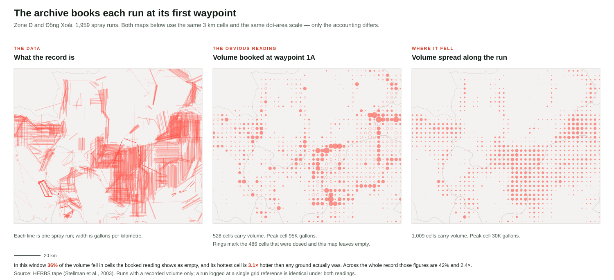

# Methods

How the maps in this project turn the HERBS record into a picture, and what
that picture can and cannot be asked.

A fuller write-up, prepared for the authors of the record, is
[`methods-paper.md`](methods-paper.md).

Everything here is reproducible:

```
node scripts/analyse-binning.mjs        # the tables below
node scripts/build-figure-binning.mjs   # docs/figures/binning-comparison.svg
```

---

## 1 · The source, and the one thing about it that matters

The HERBS tape (Stellman et al., 2003) records Operation Ranch Hand as
**24,604 waypoints** grouped into **9,141 missions** and, within them,
**11,273 spray tracks** (what `hea-v` calls runs). Each track is a chain of
waypoints — 1A, 1B, 1C — joined end to end; a second track on the same mission
is 2A, 2B … The median track traces an **11 km polyline**, and 1,434 missions
(15.7%) flew more than one.

One field decides how the record can be drawn:

> **All 19,490,690 gallons sit on rows labelled 1A. Every other leg label sums
> to exactly 0.**

Measured against the source in `scripts/build-spray-tracks.mjs`, not inferred,
and confirmed by the tape's own record layout (Christian, 1985; quoted in
[`methods-paper.md`](methods-paper.md) §2): gallons are "the number of gallons
of herbicide dispensed during the mission cited", a per-mission field.

The archive books each mission's entire volume against the **first waypoint of
its first track**. That is an accounting convention, not a statement about
where herbicide landed — and a map drawn straight from those fields inherits
the convention without saying so.

Source coordinates are quantised to 0.001°, about **111 m** on the ground —
30× finer than the smallest cell any of these maps uses. Positional
quantisation is therefore not a term in anything below.

## 2 · Two readings of the same record

| | what it does | what it claims |
|---|---|---|
| **Booked at 1A** | the whole mission's gallons in the cell holding its first waypoint | this is where the archive keeps its accounts |
| **Spread along the tracks** | gallons per kilometre × length, distributed along every track the mission flew | this is where the herbicide fell |

Both carry the identical total, **19.491 M gallons**. Nothing is created or
lost. **The disagreement between them is purely spatial.**

That matters for what each can support: any statement about a national or
provincial total is unaffected by the choice. Every statement about a *place*
depends on it entirely.



## 3 · How far apart the two readings are

Whole record. "Volume to move" is the share of all gallons that would have to
be physically relocated to turn one field into the other.

| cell | cells with volume | volume to move | peak cell |
|---|---|---|---|
| 1 km | 4,880 → 37,257 | 83% | 2.46× |
| **3 km** | **2,960 → 7,620** | **59%** | **2.51×** |
| 7 km | 1,761 → 2,835 | 43% | 1.91× |
| **13 km** | **839 → 1,017** | **26%** | **1.11×** |
| 28 km | 289 → 313 | 12% | 0.99× |
| 56 km | 97 → 102 | 5% | 0.99× |
| 111 km | 38 → 40 | 2% | 0.98× |

**The disagreement dies at the scale of a run.** The median run is 11 km; above
about 28 km a run stays inside its own cell and the booking convention stops
mattering. Below it, the convention decides the map.

The consequence is the reverse of what a reader expects: **the booked reading
is nearly right on a thumbnail of the whole country and worst at the scale
where someone looks closely.** It fails at exactly the moment it is trusted.

## 4 · What that does to a density field

Cumulative deposited volume, gal/km², over the union of cells either reading
gives volume to.

| cell | mean | mean abs difference | relative | dosed cells read as 0 | >2× out | Spearman |
|---|---|---|---|---|---|---|
| 1 km | 430 | 714 | 166% | 88% | 97% | 0.11 |
| **3 km** | **232** | **273** | **118%** | **63%** | **85%** | **0.34** |
| 7 km | 156 | 134 | 86% | 39% | 70% | 0.56 |
| 13 km | 109 | 57 | 53% | 19% | 46% | 0.80 |
| 28 km | 82 | 19 | 24% | 8% | 20% | 0.95 |
| 56 km | 63 | 7 | 11% | 5% | 9% | 0.98 |
| 111 km | 40 | 2 | 4% | 5% | 5% | 0.99 |

At 3 km — the scale of the explorer's fine grid — the difference between the
two readings is **larger than the quantity being mapped**, and **63% of cells
that received herbicide read as zero** under the booked reading. Rank
correlation is 0.34: it does not merely misstate how much, it fails to order
which place received more.

## 5 · The argument, given that there is no ground truth

**Nobody measured gallons per square kilometre on the ground in 1967.** Both
fields above are estimates derived from the same records. Every figure in §3
and §4 is a *disagreement between two readings*, never an error against a true
value, and this document does not claim otherwise.

Spreading volume along the tracks assumes a constant rate, which is an assumption.
So the assumption is pushed as hard as the record allows: the herbicide fell
*somewhere along the track the aircraft flew* — that much the record does
establish — and within that constraint the rate profile is varied to extremes.

Volume to move, relative to a constant rate:

| cell | 2× front-loaded | 2× back-loaded | middle-heavy | ends-heavy | **booked at 1A** |
|---|---|---|---|---|---|
| 3 km | 14% | 14% | 7% | 7% | **59%** |
| 13 km | 8% | 8% | 2% | 2% | **26%** |
| 28 km | 3% | 3% | 1% | 1% | **12%** |

A second, smaller question sits inside the first: the file books the load per
**mission**, and a mission may have flown several tracks. Spreading the load by
length across all of them (what the maps now do) against spreading each
track's own booked figure along that track alone moves **4.8%** of the volume
at 3 km, 2.4% at 13 km and 1.2% at 28 km
(`scripts/analyse-mission-spread.mjs`) — inside the envelope above, and an
order of magnitude below the booking convention.

**This is the finding.** Within the family of readings the record admits, the
answer is settled to about ±15% at 3 km, under rate profiles far more extreme
than anything Ranch Hand is likely to have flown. Booking everything at 1A sits
roughly four times outside that entire envelope.

It is therefore not one plausible reading among several. **It lies outside the
range of readings compatible with the aircraft having flown the track the
record itself supplies** — it requires that eleven kilometres of a spraying run
received nothing.

## 6 · What the maps draw

All four views derive from one geometry (the runs as lines) and one quantity
(gallons), with totals conserved between them. They are three resolutions of a
single encoding, not three competing encodings.

| surface | tier | mark | cell / unit | binned from |
|---|---|---|---|---|
| Archive | z < 7 | dot, area ∝ gallons | 3.3 km cells, aggregated to 13 km | the lines |
| Archive | 7 – 9 | dot, area ∝ gallons | 3.3 km | the lines |
| Archive | z > 9 | line, width = gallons per km | the run itself | — |
| Story | all | heat field, KDE 3–7 km on the ground | 3.3 km cell × month | the lines |

This is the shipped map. There is no URL that returns any surface to the booked
reading; the comparison lives in `scripts/analyse-binning.mjs`, where it is
labelled as what it is.

The Story's field is built by `scripts/build-story-heat.mjs` into the same
0.03° cell the Archive's fine tier uses — one binning, two presentations —
split by month because the Story's heat layer filters on the playhead and month
is the resolution it steps in. It carries the record's total to the gallon
(19.491 M) and is *smaller* than the waypoint file it replaced: 23,729 points
against 24,604, because binning 8,753 tracks into shared cells collapses more
than sampling them adds.

**A binned field has two constraints a scattered one does not**, and both were
found by looking at the result rather than by reasoning about it:

1. *Position.* A point placed at its cell's geometric centre puts the whole
   field on a lattice, and at the Story's deep node zooms it renders as graph
   paper. Each point sits at the volume-weighted centroid of the samples that
   made it instead — a cell clipped by one straight run gets a point on that
   run. Same point count, no lattice, and closer to where the volume was.
2. *Kernel.* A KDE whose kernel is narrower than its sample spacing does not
   smooth; it draws the samples. The cell is 3.33 km, which is 0.0217 × 2^z
   pixels, so `heatmap-radius` tracks 0.043 × 2^z — about twice the spacing,
   which is what it took on the page for the field to read as continuous. The
   intensity ramp was flattened to match: with a kernel that now covers a fixed
   ground area, the number of points inside it no longer changes with zoom, so
   the intensity should not either.

**Why the Story draws a field, and how to read it.** The Story's nodes sit
between z6.3 and z9.6 on a map that also carries relief, place names, a
narrative card and a playhead. At those zooms the record's own marks are
either a lattice of cell-bound dots or, as runs, dashes a few pixels long.
The field is the same fine-tier binning smoothed over about two cells, so
that where the decade's volume accumulated reads at a glance and fills in
month by month as the reader scrolls. It is a reading aid over the same
gallons, not a further quantity: every constant in it (the cell, the month,
√(gallons / p90), the radius, the intensity, the ramp, the opacity) is listed
in `docs/methods-paper.md` §6.4 and its appendix, its scale is ordinal (the
legend says less and more; the key's note says what is counted), and nothing
in it is a claim about deposition. The alternatives were drawn on the page
before this was settled, in September 2026: the Archive's dots at their own
size and enlarged, the same dots soft-edged, and the Stellmans' hit grid.
They are recorded, with what they showed, in `docs/decisions.md`.

**The Hit Frequency model, and its classes.** The Atlas's second model is
the Stellmans' own (Stellman & Stellman, 2004), drawn from the
Exposure_Master table hea-v ships: for every point of the 0.01° study
grid, the number of recorded spray paths that passed within 0.5, 1, 2 or
5 km of it, summed per cell and agent group by `scripts/build-proximity.mjs`
with no transformation of ours. The counts are heavy-tailed at every
distance (all agents, cells with at least one hit: median 2 at 0.5 km and
7 at 5 km, 99th percentile 14 and 110, maximum 95 and 329), so the colour
ramp uses seven fixed classes that double: 1, 2–3, 4–6, 7–12, 13–25,
26–50, 51 or more. A geometric ladder is the classification for a count
that spans two orders of magnitude, and a constant ratio makes each step
the same perceived step; the ratio of two is the plainest one to state,
and the key says it. The same seven in every band and for every agent, so
one colour means one count wherever it appears. Measured on the table,
every band uses at least five of the seven (0.5 km: 42 / 32 / 18 / 7 / 1 /
0 / 0 per cent of cells; 5 km: 16 / 17 / 16 / 17 / 17 / 10 / 7). Equal
intervals (1–5, 6–10, …) put 88% of the cells at 0.5 km in the first
class; five classes ending at 21+ put 22% of the cells at 5 km, 21 to 329
hits, in one colour; nine classes would spend two more tones on the 6% of
cells above 50 at 5 km alone. The exact counts are on the cell's hover or
tap, so the colour's job is rank, not readout.

**Why tiers at all.** The median run is 11 km. Across the explorer's zoom range
that line measures **7 px at the zoom floor and 291 px at the ceiling — a
factor of 42**. Below roughly 15 px a line cannot be told from a dot, so
drawing individual runs there adds noise and no information; above it, drawing
an aggregate discards the repetition, the turns and the parallel swaths that
are the record's real structure. This is ordinary cartographic generalisation.

That measurement sets a **floor**, not an answer. The 15 px threshold is
crossed near z6.8, so any hand-off from there upward is defensible; 9 is chosen
because at 7–8 the strokes on screen (3,039 distinct runs at 8.5) read as a
mass rather than as flight. The floor is derived; the position inside the band
is an editorial choice, and this document would rather say so than dress it up.

The fine cell measures 5.5 px when it opens at z7 — below about 5 px adjacent
cells merge on arrival, which is the condition the coarse tier exists to
avoid.

**Why line width is linear in gallons per kilometre.** A stroke's ink is width ×
length and a run's volume is gpk × length, so a linear width makes ink
proportional to volume — the same area-true principle the dots use, reached
through the other geometry. Gallons per kilometre is also the only quantity in
this record that is comparable *between* runs: a 40 km run and a 2 km run
carrying the same load did very different things to the ground beneath them.

## 7 · What these maps do not claim

- **Deposited volume, not exposure or dose.** No drift, no degradation, no
  half-life, no soil or canopy interception, no population. An earlier version
  of this project carried a decay layer; it was removed because a single decay
  constant across agents with chemistries as different as picloram, TCDD and
  cacodylic acid produced a map that said the opposite of its own subject.
- **No swath width.** A run is drawn as a line; the real spray swath had width.
  At every cell size used here that width is sub-cell.
- **A heat blob is not a footprint.** The Story's field is smoothed over about
  two cells (3 to 7 km on the ground, by zoom). The edge of a blob is where the
  kernel runs out, not where the spraying stopped, and its colour is relative
  to the 90th percentile of the cell-month totals, not a quantity on a scale.
- **Straight-line interpolation** between consecutive waypoints. The waypoints
  chain end to end at a median 2.63 km gap, so the interpolated path is short
  relative to the cells.
- **The record is not a survey.** It is what was filed. Runs that were flown and
  never recorded are absent from every reading here.
- **"The obvious reading" is not an accusation.** It names what happens when the
  file's fields are drawn directly. It is not a claim about any published work.

## 8 · Sources

- Stellman, J.M., Stellman, S.D., Christian, R., Weber, T., Tomasallo, C. (2003).
  The extent and patterns of usage of Agent Orange and other herbicides in
  Vietnam. *Nature* 422, 681–687.
- HERBS tape as republished at `github.com/andrewstellman/hea-v`, pinned commit.
- Georeferencing and run reconstruction: `scripts/build-spray-data.mjs`,
  `scripts/build-spray-tracks.mjs`.
